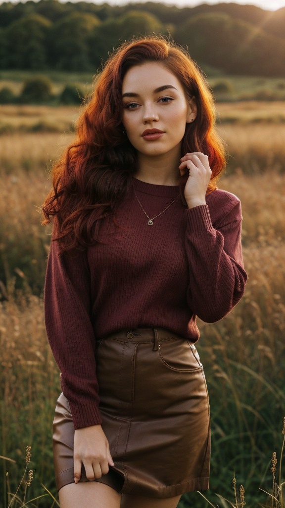

# 📑 Wildcards Collection for Stable Diffusion

<!--     -->

**Wildcards** in this collection are mainly created for realistic scenes with people. Hoever, they can be used for other types of art as well. They will give you inspiration and boost your creativity.

Since I work with these Wildcards myself, I catch problematic keywords and remove them. Sometimes I also add new keywords, and even entire files. I'm constantly looking for new ideas to expand this collection.

The main idea is to not overcomplicate things. Dealing with thousands of weirdly named wildcards may be overwhelming. I believe it's better to have a few that you **can remember** and **use effectively**.

# 💻 Preparations

To use these Wildcards, you need an extension. You can use one of the following:

- [sd-dynamic-prompts](https://github.com/adieyal/sd-dynamic-prompts) `Recommended`
- [stable-diffusion-webui-wildcards](https://github.com/AUTOMATIC1111/stable-diffusion-webui-wildcards)

<details>
<summary>Show extra info</summary>

### Check if the extension works

Most likely, after installing the extension, you'll need to restart Stable Diffusion (or the [rented server instance](https://cloud.vast.ai/?ref_id=62878&creator_id=42512&name=null)) for the extension to work correctly. **A simple reload of WebUI may not be sufficient**. You can easily check if the extension works by generating an image. If the keyword `colors` appears where you used `__colors__` wildcard, it means something is wrong.

If you installed the extension using the [Provisioning Script](https://github.com/ai-dock/stable-diffusion-webui/blob/main/config/provisioning/default.sh) from [AI-Dock](https://github.com/ai-dock/stable-diffusion-webui), a restart will not be necessary 👌

### Useful optional steps

If you decided to use [sd-dynamic-prompts](https://github.com/adieyal/sd-dynamic-prompts), I recommend you to enable one useful option in the extension settings.  
`Settings > Uncategorised > Dynamic Prompts > Save template to metadata: Write prompt template into the PNG `

</details>

# 💾 Installation

Once you have a working Wildcards extension, you need wildcard `.txt` files in appropriate directory. In the case of the two mentioned plugins, it will be the `wildcards` directory in the main directory of the extension.

The path to the directory may look like this:  
`stable-diffusion-webui/extensions/sd-dynamic-prompts/wildcards/`  
`stable-diffusion-webui/extensions/stable-diffusion-webui-wildcards/wildcards/`

Navigate to **the proper directory** and download the files.  
You can download them with the following command:

## Download automatically with [BASH](https://www.gnu.org/software/bash/) script using [WGET](https://www.gnu.org/software/wget/)

### Download automatically with bash and wget

```bash
wget -qO- https://raw.githubusercontent.com/Avaray/stable-diffusion-simple-wildcards/sdxl/scripts/download.sh | bash -s -- wget sdxl
```

<details>
### Download automatically with bash and aria2c

```bash

aria2c -q --allow-overwrite=true --remove-control-file=true -o dl.sh https://raw.githubusercontent.com/Avaray/stable-diffusion-simple-wildcards/sdxl/scripts/download.sh &&
chmod +x dl.sh &&
./dl.sh aria2c sdxl

```

### Download automatically with bash and curl

```bash

curl -s https://raw.githubusercontent.com/Avaray/stable-diffusion-simple-wildcards/sdxl/scripts/download.sh | bash -s -- curl sdxl

```

</details>

# ⚡️ Usage

A **Wildcard** is essentially a name of a file that contains a list of keywords, one per line. If you have a file named `colors.txt`, you can use the wildcard in your prompt as `__colors__`. Stable Diffusion will replace `__colors__` with a random keyword from the `colors.txt` file.

Let's say you want to generate a scene with a woman in a random location. Let her clothing be random as well.  
`photography of __nationalities__ woman BREAK wearing __colors__ __clothes_upper__ BREAK in __locations__`

The initial prompt will look like this:  
`photography of Polish woman BREAK wearing black dress BREAK in restaurant`

With [sd-dynamic-prompts](https://github.com/adieyal/sd-dynamic-prompts), you can also use [Variables](https://github.com/adieyal/sd-dynamic-prompts/blob/main/docs/SYNTAX.md#variables)

`${c=__colors__} woman in __locations__ BREAK ${c} shirt BREAK ${c} skirt BREAK ${c} boots`

The prompt will look like this:  
`woman in park BREAK pink shirt BREAK pink skirt BREAK pink boots`

<details>
<summary>Show extra info</summary>

### WARNING

Checkpoints that are based on `Pony Diffusion` may not work with some of these Wildcards. `Pony Diffusion` checkpoints were trained on completely different data and lack the knowledge about many things. `Nationalities`, `Artists`, `Cameras` and `Films` most likely will not work at all. If you are planning to use these Wildcards for generating realistic scenes, you should use good checkpoints focused on real people. I recommend using one of following checkpoints:

- [WildCardX-XL](https://civitai.com/models/239561/wildcardx-xl) `SDXL 1.0`
- [ZavyChromaXL](https://civitai.com/models/119229/zavychromaxl) `SDXL 1.0`
- [\_CHINOOK\_](https://civitai.com/models/400589/chinook) `SDXL 1.0`
- [epiCRealism XL](https://civitai.com/models/277058/epicrealism-xl) `SDXL 1.0`

For `Nationalities` it's good to be around `CFG Scale 6-7` to see how prompt affect the generated person (you can read more about it [here](https://dav.one/using-prompts-to-modify-face-and-body-in-stable-diffusion)). For `Artists` it's better to have `CFG Scale 2-5` to achieve best results. In both cases Checkpoint will have the biggest impact on the final result. Every checkpoint is different.

### Extra tips

1. You can read more about `BREAK` keyword [in this Reddit post](https://www.reddit.com/r/StableDiffusion/comments/15bty86/prompt_trick_for_more_consistent_results_in/).
2. Do not use `realistic` keyword when you are generating realistic scenes in SDXL.
3. No, SD 1.5 isn't better than SDXL 😂
</details>

# 🍺 Original Sources and Copyrights

<!-- sdxl -->

- The list of Nationalities `nationalities.txt` was inspired by [this Reddit post](https://www.reddit.com/r/StableDiffusion/comments/13oea0i/photorealistic_portraits_of_200_ethinicities/).
- The list of Light types `lighting.txt` was inspired by [this Reddit post](https://www.reddit.com/r/StableDiffusion/comments/1cjwi04/made_this_lighting_guide_for_myself_thought_id/).
- The first list of Artists `artists.txt` was obtained from the [Stable Diffusion Cheat-Sheet](https://supagruen.github.io/StableDiffusion-CheatSheet/).
- The second list of Artists `artists2.txt` was obtained from the [SDXL Artist Style Studies](https://sdxl.parrotzone.art/).
- The lists of Cameras `cameras.txt` and Films `camera_films.txt` were obtained from the [SDXL 1.0 Artistic Studies](https://rikkar69.github.io/SDXL-artist-study/).

<!-- /sdxl -->

<!-- pdxl -->

- Lists of Characters from Videogames `videogame.txt`, Animations `animation.txt` and Anime `anime.txt` were created by [etude2k](https://civitai.com/user/etude2k) and posted on [CivitAI](https://civitai.com/models/338658/pony-diffusions-characters-wildcards).

<!-- /pdxl -->

- The rest of the files were created by me. For wildcards I used [ChatGPT](https://chat.openai.com) and [Claude](https://claude.ai/).

# 📝 Contributing

If you believe something is missing, that something could be useful, or that something should be removed, go ahead - [fork this repository, edit the files, and submit a pull request](https://docs.github.com/en/get-started/quickstart/contributing-to-projects).  
Catch me on [Discord](https://discord.gg/) if you have any questions or suggestions: `avaray_`

You can also support me on [GitHub Sponsors](https://github.com/sponsors/Avaray), [Patreon](patreon.com/Avaray_), or [Buy Me a Coffee](https://buymeacoffee.com/avaray).
